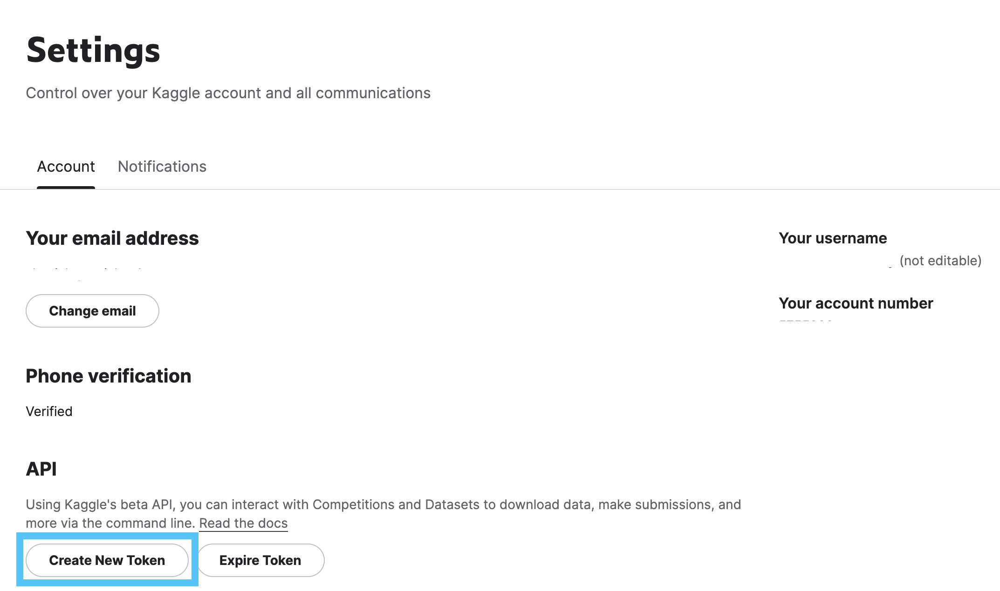

# RvF - Real vs Fake Face Detection

Deepfakes are everywhere now, and like us you're probably wondering ["wow how am I going to figure out if that video of Morgan Freeman telling me he isn't real, is actually real?"](https://youtu.be/oxXpB9pSETo). While a true deepfake detector is too complicated for a single semester, we're going to do something a little bit easier - try and determine whether a picture of a face is fake or not. You'll definitely enjoy this project if you want to learn about neural networks, computer vision, and figuring out if your friend keeps Photoshopping their Instagram posts.

**Skills Learned**: Machine Learning, Deep Learning, Computer Vision, PyTorch, TensorFlow

## Timeline (Tentative)

| Date | Topic | Deliverable / Task |
| ---- | ----- | ----------- |
| 2/11/2024 | Introduction + Convolutional Neural Networks | PyTorch CNN Practice |
| 2/18/2024 | CNN Practice | Simple CNN Classification Competition | 
| 2/25/2024 | _SPRING BREAK_ ||
| 3/3/2024 | _SPRING BREAK_ ||
| 3/10/2024 | Team Assignments + Data Augmentation | Model Development Ideas |
| 3/17/2024 | Data Augmentation + Model Architecture | Initial `model.py` file |
| 3/24/2024 | Model Development ||
| 3/31/2024 | Model Development + Interpretability ||
| 4/7/2024 | Model Development ||
| 4/14/2024 | Model Development + Expo Prep | Project Poster |
| 4/19/2024 | Project Expo 🎉 ||

## Setup (Colab)
The preferred method for loading the dataset and writing the model implementation for this project will be via Google Colab. Click the button below to follow the quickstart for loading the dataset in Google Colab.

<a target="_blank" href="https://colab.research.google.com/github/MichiganDataScienceTeam/W24-RvF/blob/main/notebooks/colab_image.ipynb">
  
</a>

## Setup (Local)
Follow the steps below to setup the data for this repository locally on your computer (or a cloud computer)
1. **Create a virtual environment**. This project assumes you have Python 3.9 or later.
   ```bash
   python3 -m venv env
   source env/bin/activate
   pip install -r requirements.txt
   ```
2. **Add the `secrets` folder in the root directory**
   ```bash
   mkdir secrets
   ```
3. **Create a [Kaggle](https://www.kaggle.com/) account** to download the datasets for this project if you don't have one already.
4. **Generate an API Key in Kaggle** - click on your profile at the top right, and select Settings. You should see a page similar to the screenshot below. Click on the "Create New Token" button. 
5. Download your API Key and save it to the `secrets` folder.
6. Run the following command to download the dataset and setup the folder structure
   ```bash 
   ./data/download.sh
   ```
   You may see a warning regarding your environment like below. This is fine as long as you ran the previous steps correctly and your Python virtual environment was enabled correctly.
   > `WARNING: Your Python virtual environment should be enabled while running this script!`

If your setup succeeded, your directory should resemble the structure seen below.
```
.
├── README.md
├── data
│   ├── download.sh
│   └── rvf140k
│       └── ... // all the dataset content
├── media
│   └── ... // screenshots
├── notebooks
│   └── ... // notebooks that we will use throughout the project
├── requirements.txt
└── secrets
    └── kaggle.json
```


## Other Resources
- **PyTorch Documentation** - [https://pytorch.org/docs/stable/index.html](https://pytorch.org/docs/stable/index.html)
- **PyTorch Basic Tutorial** - [https://pytorch.org/tutorials/beginner/basics/intro.html](https://pytorch.org/tutorials/beginner/basics/intro.html)
- **Neural Network Introduction** - [https://cs231n.github.io/neural-networks-1/](https://cs231n.github.io/neural-networks-1/)
- **Example CNN** - [https://www.kaggle.com/code/akassshhhh/challenging-fake-image-detection](https://www.kaggle.com/code/akassshhhh/challenging-fake-image-detection)
- **RvF - CNN Crash Course (UMich Only)** - https://docs.google.com/presentation/d/1R6YwVkn8a_pYOykxGSW1JDuewv_IK8L86jrh2-XL0Cc/edit?usp=sharing
- **All About Convolutional Neural Networks** - [https://cs231n.github.io/convolutional-networks/](https://cs231n.github.io/convolutional-networks/)